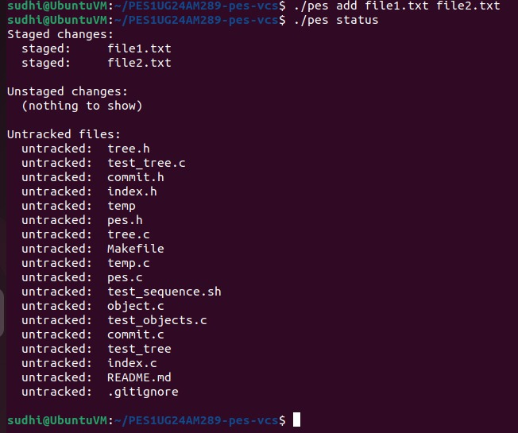
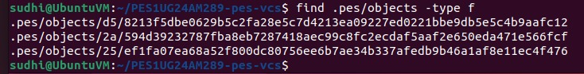
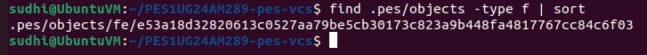

# PES-VCS: Branching, Checkout, and Garbage Collection

---

## Q5.1: Implementing `pes checkout <branch>`

A branch is stored as a file in `.pes/refs/heads/` containing a commit hash. Checking out a branch involves updating references and synchronizing the working directory.

### Steps:

1. **Update HEAD**
   - Modify `.pes/HEAD` to:
     ```
     ref: refs/heads/<branch>
     ```

2. **Read Target Commit**
   - Read commit hash from `.pes/refs/heads/<branch>`
   - Load commit object
   - Extract the root tree

3. **Update Working Directory**
   - Traverse the tree recursively
   - For each blob:
     - Read object from `.pes/objects`
     - Write contents to the corresponding file
   - Remove files not present in the new tree

4. **Update Index**
   - Rebuild `.pes/index` to match the checked-out tree

### Complexity:

- Recursive tree traversal
- Safe deletion of files
- Preventing overwrites of uncommitted changes
- Maintaining consistency between HEAD, index, and working directory

---

## Q5.2: Detecting Dirty Working Directory Conflicts

Before switching branches, conflicts must be detected to avoid losing uncommitted changes.

### Approach:

1. **Compare Index vs Working Directory**
   - For each indexed file:
     - Use `stat()` to compare:
       - file size
       - modification time
   - If mismatch → file is modified

2. **Compare Target Tree vs Index**
   - Check if file differs between current branch and target branch

### Conflict Condition:

Checkout must be refused if:
> A file is modified in the working directory AND differs between the current branch and the target branch.

### Rationale:

- Index represents last committed state
- Working directory represents current state
- Object store contains all versions

---

## Q5.3: Detached HEAD

A detached HEAD occurs when:
HEAD → commit hash (not a branch reference)


### Behavior:

- New commits can still be created
- No branch is updated
- Commits become unreferenced (dangling)

### Risk:

- Switching branches may make these commits unreachable
- They may be deleted by garbage collection

### Recovery:

- Create a new branch pointing to the commit:
git branch <branch-name> <commit-hash>

---

## Q6.1: Garbage Collection Algorithm

Over time, unreachable objects accumulate in `.pes/objects`.

### Algorithm:

1. **Collect Root References**
 - Read all branch heads from `.pes/refs/heads/`

2. **Traverse Commits**
 - Follow parent links recursively

3. **Traverse Trees**
 - From each commit → visit tree
 - From tree → visit blobs and subtrees

4. **Mark Reachable Objects**
 - Store visited hashes in a set

5. **Delete Unreachable Objects**
 - Remove any object not in the reachable set

### Data Structure:

- **Hash Set**
- O(1) lookup
- Prevents duplicate visits

### Estimation:

For:
- 100,000 commits
- 50 branches

Objects visited:
- ~100,000 commits
- ~100,000 trees
- Hundreds of thousands of blobs

Total: **Hundreds of thousands to millions of objects**

---

## Q6.2: Garbage Collection Race Condition

### Problem:

If garbage collection runs concurrently with a commit:

1. Commit process:
 - Writes tree object
 - Writes commit object
 - Updates HEAD

2. Garbage collection:
 - Scans reachable objects
 - Does not see new commit yet
 - Deletes newly created objects

### Result:

- Commit references missing objects
- Repository corruption

### Prevention (Git's Approach):

- Locking mechanisms to prevent concurrent operations
- Writing objects before updating references
- Atomic updates to HEAD
- Protecting recently created objects from deletion

---

## Screenshots:

### Phase 1:
Command:
```bash
./test_objects
```


Command:
```bash
find .pes/objects -type f
```



### Phase 2:
Command:
```bash
./test_tree
```


Command:
```bash
find .pes/objects -type f
```


### Phase 3:
```bash
./pes init
./pes add file1.txt file2.txt
./pes status
```
